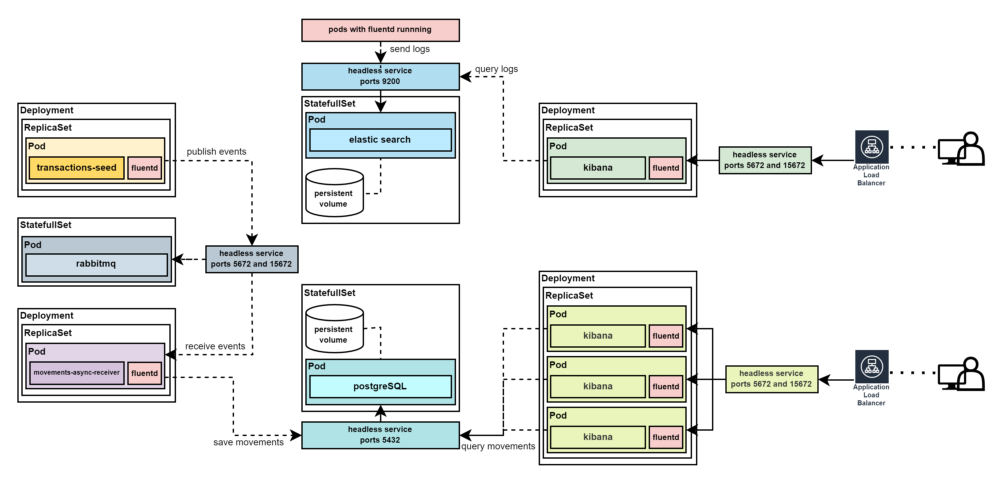

## Introduction

This project aims to provide an API for retrieving account movements, applying concepts like async communications, observability, and the use of containers and orchestration. It is built upon the foundation of the [existing repository](https://github.com/matheus-oliveira-andrade/transactions-k8s)  created to run on any Kubernetes cluster. This version is designed to run on Kubernetes using the AWS EKS service; all required resources are provisioned by IAC using Terraform.

## Getting Started

Project to expose, through an API, the report of movements from the accounts. Transactions are created by the `Seed` console application and published to a topic in `RabbitMQ`, then read by the `Movements.AsyncReceiver` application, which processes and saves the data in the `PostgreSQL` database. This data is then exposed through the `Movements.Api`.

### Setup

1 - Creating AWS EKS Cluster
  - All required resources and steps to create EKS Cluster can be found in this [README](/infra/README.md)

2 - Apply k8s manifests
   ```bash
   # use parameter --build-push to build and push docker images to docker hub
   ./run.sh # --build-push
   ```

3 - Application load balancers addresses
```bash
kubectl get ingress
# NAME             CLASS               HOSTS   ADDRESS                                                                 PORTS   AGE
# apps-ingress     aws-ingress-class   *       k8s-default-appsingress-74a914e12f-156167.us-east-1.elb.amazonaws.com   80      39s
# kibana-ingress   aws-ingress-class   *       k8s-default-kibanaingress-364e026a6b-1816.us-east-1.elb.amazonaws.com   80      38s
```

4 - Access movements public API 
   - Docs movements API - Swagger
     ```bash
     http://{{apps-ingress-lb-address}}/movements/swagger
     ```
   - Example get movements report using movements API
     ```bash
     curl http://{{apps-ingress-lb-address}}/movements/v1/report/123456-78
     ```

5 - Configure kibana to use index of logs
   - Kibana address
     ```bash
     http://{{kibana-ingress-lb-address}}
     ```
   - Index to see logs:
       1. Address to configure index patterns page
          ```bash
          http://{{kibana-ingress-lb-address}}/app/management/kibana/indexPatterns
          ```
       2. Create `Data view`
       3. Recommended name: `fluentd-logs` 

### Clean up
   ```bash
   ./clean-up.sh
   ```

### Architecture

- **transactions-seed**: Responsible for reading fake data about transactions from a JSON file and then publishing data to a topic
- **movements-async-receiver**: Responsible for reading events from a queue attached to the topic and saving these movements in a PostgreSQL database
- **movements-api**: REST API responsible for exposing reports of account movements for an account
- **nginx ingress**:  Responsible for redirecting traffic to the right locations
- **fluentd**: Responsible for tailing log files and sending them to Elasticsearch
- **kibana**: Interface responsible for querying and visualizing logs in Elasticsearch



### Technologies

- `C#` was used as the language with `.net 6`, following some of the concepts of `clean architecture`. For `unit tests`, `xunit` and `moq` were used.
- `Docker` was used for the application containers with `kubernetes` for container orchestration.
- `PostgreSQL` was chosen as the database.
- `RabbitMQ` was chosen as the message broker.
- `Fluentd` was used for log aggregation, sending the logs to `Elastic Search`.
- `Kibana` was used for log visualization.
- `GitHub Actions` were used for `CI` while the application was being developed, built, and tested on each push.
- `Kubernetes` was used to deploy and host all components

