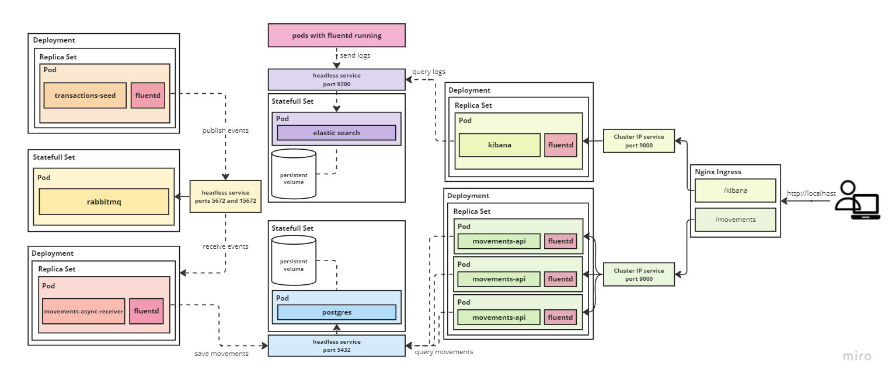

## Introdution

This project aims to provide an API for retrieving account movements, applying concepts like async comunications, observability and use of container orchestration. It is built upon the foundation of the [existing repository here](https://github.com/matheus-oliveira-andrade/transactions) and is designed to run seamlessly in a Kubernetes environment.

## Getting Started

Project to expose, through an API, the report of movements from the accounts. Transactions are created by the `Seed` console application and published to a topic in `RabbitMQ`, then read by the `Movements.AsyncReceiver` application, which processes and saves the data in the `PostgreSQL` database. This data is then exposed through the `Movements.Api` at the `/report/{{accountId}}` endpoint.

### Setup in docker-desktop

1 - execute script [`run.sh`](run.sh) to create all required resources
   ```bash
   # use parameter --build-push to build and push docker images to docker hub
   ./run.sh # --build-push
   ```

2 - Access movements public API 
   - Docs movements API - Swagger
     ```bash
     http://localhost/movements/swagger
     ```
   - Get movements report for account 123456-78
     ```bash
     curl http://localhost/movements/v1/report/123456-78
     ```

3 - Access logs in kibana
   - Local Kibana address
     ```bash
     http://localhost/kibana
     ```
   - Configuring index pattern for see logs:
       1. [Index patterns page](http://localhost/kibana/app/management/kibana/indexPatterns)
       2. Create data view
       3. Name: fluentd-logs
       4. Create data view button

4 - Clean up, run script [`clean-up.sh`](clean-up.sh)
   ```bash
   ./clean-up.sh
   ```

### Architecture

- **transactions-seed**: Responsible for reading fake data about transactions from a JSON file and then publishing data to a topic
- **movements-async-receiver**: Responsible for reading events from a queue attached to the topic and saving these movements in a PostgreSQL database
- **movements-api**: REST API responsible for exposing reports of account movements for an account
- **nginx ingress**:  Responsible for redirecting traffic to the right locations
- **fluentd**: Responsible for tailing log files and sending them to Elasticsearch
- **kibana**: Interface responsible for querying and visualizing logs in Elasticsearch



### Technologies

- `C#` was used as the language with `.net 6`, following some of the concepts of `clean architecture`. For `unit tests`, `xunit` and `moq` were used.
- `Docker` was used for the application containers with `kubernetes` for container orchestration.
- `PostgreSQL` was chosen as the database.
- `RabbitMQ` was chosen as the message broker.
- `Fluentd` was used for log aggregation, sending the logs to `Elastic Search`.
- `Kibana` was used for log visualization.
- `GitHub Actions` were used for `CI` while the application was being developed, built, and tested on each push.
- `Kubernetes` was used to deploy and host all components

